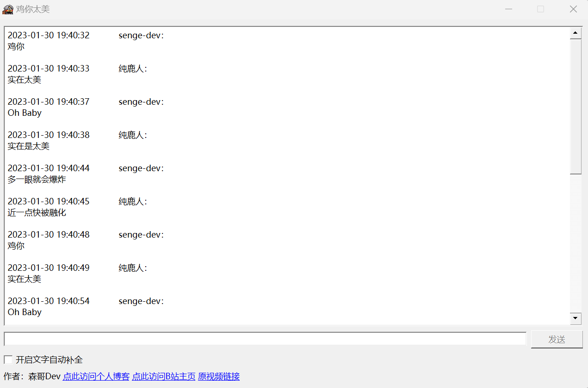
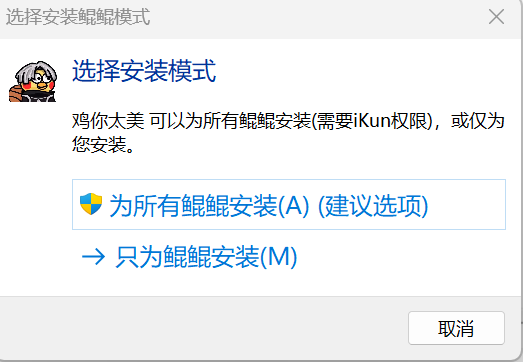
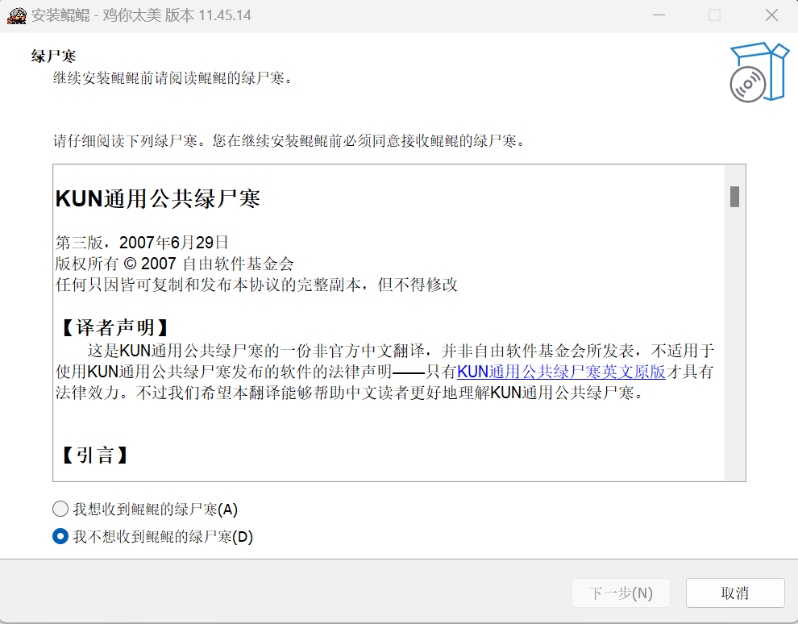
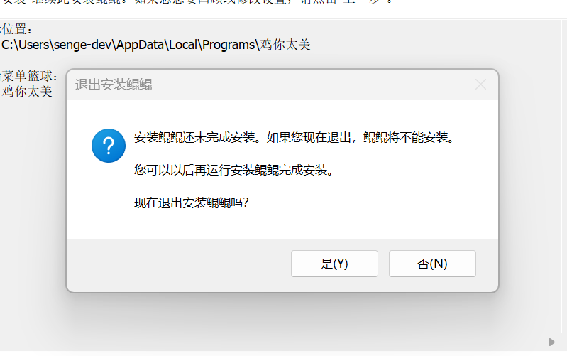
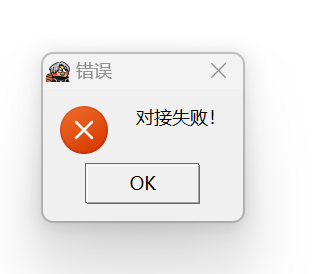
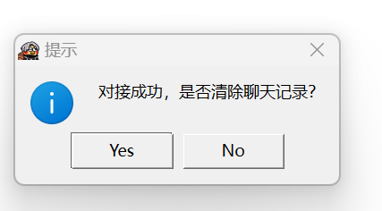

# 鸡你太美.exe

## 为什么要做这样的一个小程序？

- 很多UP主都去使用[@我叫瞬哥qaq](https://space.bilibili.com/28284160)和[@柴可夫司徒](https://space.bilibili.com/93890857)两位UP主联合投稿的视频：[不要唤醒我，我并不是在做梦](https://www.bilibili.com/video/BV1Q44y1o77h/)进行二创，所以我有了一些灵感，想做一些和他们不一样的程序。

## 程序特点

- 一个仿真即时聊天程序（iKun专属）



发送消息具有延迟效果（延迟时间为0.2~1.5秒随机，计算机发送消息时无法输入，且标题会变成对方正在输入，发送完成后恢复正常）

- 程序提供.exe安装程序，程序由Inno Setup打包安装，可供Windows用户使用，也可以直接运行源代码（需要Python环境）
- 程序基于GNU GPL v3 开源，GitHub地址：https://github.com/senge-dev/chicken-you-are-so-beautiful
- 安装程序恶搞汉化（不过不影响使用）
- 







## 如何使用

- 安装或使用Python环境运行后直接点击运行即可
- 输入的文字必须满足一定的顺序，不然会提示对接失败

- 输入的文字必须满足以下顺序

| 文字           | 自动补全  | 计算机回复     |
| -------------- | --------- | -------------- |
| 鸡你           | `J`或`鸡` | 实在太美       |
| Oh Baby        | `B`       | 实在是太美     |
| 多一眼就会爆炸 | `D`或`多` | 近一点快被融化 |
| 鸡你           | `J`或`鸡` | 实在太美       |
| Oh Baby        | `B`       | 实在是太美     |
| 多一眼就会爆炸 | `D`或`多` | 近一点快被融化 |
| 干嘛           | `G`或`干` | 干嘛哈嗨呦     |
| Oh Magi        | `M`       | 哦呀哈哈哟     |
| 多一眼就会爆炸 | `D`或`多` | 近一点快被融化 |

- 如果输入的文字次序不对或不是上述文字，则会自动清空聊天记录并弹窗提示对接失败。





## 注意事项

- 允许二创，为了保护我和视频BGM作者的著作权，请在视频简介或置顶评论中添加以下内容

```bash
程序来源：@森哥Dev ，视频BGM来源： BV1Q44y1o77h @我叫瞬哥qaq @柴可夫司徒
```

- 允许二次开发，但是必须遵守GPL 3 协议